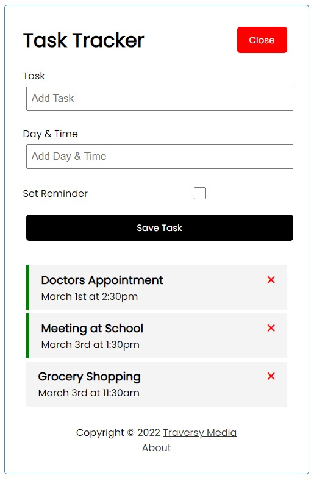

# Vue.js (v3) Task Tracker Code Along
  

## Description:
This is a code-along application created following [Traversy Media's Vue JS Crash Course](https://www.youtube.com/watch?v=qZXt1Aom3Cs) on Youtube.
 
This application was meant as a tutorial to learn Vue.js v3. It uses Vue Router and npm [JSON Server](https://www.npmjs.com/package/json-server) for backend.
 
### Topics reviewed:
* Vue CLI Setup
* Global Styles
* Components and Pages
* Dynamic Classes | v-bind directive
* Sending Props
* Events and Methods
* Routing and v-model
* JSON Server
* Production Build

## Table of Contents:
* [Usage](#usage)
* [License](#license)
* [Resources](#resources)
* [Questions](#questions)

## Usage:
  
### Deployed: 
A user can add a task that is then listed below. They can double click each task to toggle the green reminder and they can also delete a task by clicking the X. The About page in the footer takes a user to the version of the application.

## License: 

 
Licensed under MIT License.
 

## Resources:
### [Traversy Media's Vue JS Crash Course](https://www.youtube.com/watch?v=qZXt1Aom3Cs)  
### [Vue Documentation](https://vuejs.org/guide/introduction.html)  
### [Vue CLI](https://cli.vuejs.org/guide/)  
### [JSON Server](https://www.npmjs.com/package/json-server)

## Questions:
If you have any questions, you can contact me at briannaewoodruff@gmail.com or visit my GitHub [briannawoodruff](https://github.com/briannawoodruff).